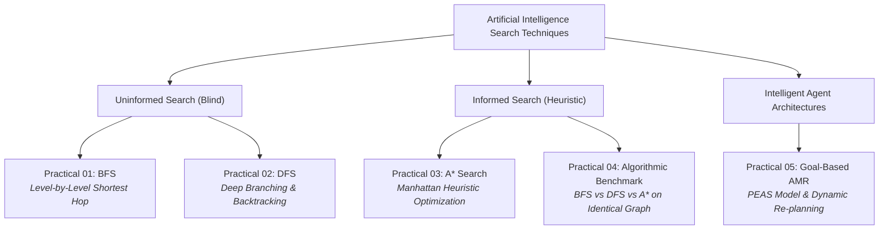

<div align="center">

# 🧠 Artificial Intelligence Fundamentals
### Practical Laboratory Portfolio & Implementation Log

[](https://www.python.org/)
[](https://mituniversity.ac.in/)
[](https://github.com/makarandbobhate)
[](https://github.com/makarandbobhate/AIF-Practicals)
[](https://github.com/makarandbobhate/AIF-Practicals)

<p align="center">
  A structured, production-grade laboratory repository illustrating foundational-to-advanced paradigms of <b>Artificial Intelligence & Heuristic Search Techniques</b> in modern Python, focusing on real-world systems modeling, algorithmic benchmarking, and autonomous goal-based intelligent agents.
</p>

</div>

---

## 📌 Student & Academic Profile

| Attribute | Details |
| :--- | :--- |
| **Candidate Name** | **Makarand Pankaj Bobhate** |
| **Roll Number** | `09` |
| **Institution** | **MIT ADT University, Pune** |
| **Department / Class** | School of AI (SO AI) |
| **Division** | Division 5 |
| **Course Module** | Artificial Intelligence Fundamentals (AI Fundamentals) |
| **Programming Language** | Python 3.8+ (PEP 8 Standard) |
| **GitHub Repository** | [makarandbobhate/AIF-Practicals](https://github.com/makarandbobhate/AIF-Practicals) |

---

## 🎯 Curriculum Objectives & Competencies

This laboratory suite targets theoretical mastery and practical engineering of core Artificial Intelligence paradigms:
* **Uninformed State-Space Exploration:** Implementing deterministic, systematic graph traversal strategies without domain-specific heuristics using FIFO queues (**Breadth-First Search**) and LIFO stacks/recursion (**Depth-First Search**).
* **Heuristic Optimization & Admissibility:** Formulating informed search strategies using the **A\* Search Algorithm** with admissible Manhattan distance metrics ($h(n) = |x_1 - x_2| + |y_1 - y_2|$) to guarantee path optimality while pruning redundant state expansions.
* **Empirical Algorithmic Benchmarking:** Conducting multi-metric comparative evaluations (path optimality, expanded state space, and wall-clock latency in $\mu s$) across identical graph topologies.
* **Deliberative Intelligent Agents (PEAS):** Designing autonomous, goal-directed physical agents operating under the **Sense-Plan-Act** cycle with real-time sensory model updates and dynamic A\* re-planning upon encountering environmental hazards.

---

## 🗺️ Algorithmic Taxonomy



---

## 📑 Lab Practicals Index

| Practical | Core AI Paradigm | Problem Statement & Applied Scenario | Code Source |
| :---: | :--- | :--- | :---: |
| **01** | **Breadth-First Search (BFS)** | **Smart City Emergency Evacuation:** Identify the nearest emergency evacuation shelter during a disaster by expanding connected municipal road intersections level-by-level to ensure minimum road hops. | [`practical_01_bfs_evacuation.py`](./practical_01_bfs_evacuation.py) |
| **02** | **Depth-First Search (DFS)** | **Treasure Hunt Game:** Navigate an intricate dungeon chamber network, exhausting deep passageways before systematically backtracking out of terminal dead ends to locate the hidden treasure chamber. | [`practical_02_dfs_treasure_hunt.py`](./practical_02_dfs_treasure_hunt.py) |
| **03** | **Heuristic A\* Search** | **Hospital Medicine Delivery Robot:** Route an automated guided vehicle (AGV) across an $8 \times 7$ hospital grid from Pharmacy to an ICU Ward, avoiding restricted quarantine partitions using Manhattan heuristic estimation. | [`practical_03_astar_hospital_robot.py`](./practical_03_astar_hospital_robot.py) |
| **04** | **Comparative Benchmarking** | **Smart City Road Network Navigation:** Empirical comparative study evaluating BFS, DFS, and A\* across identical road coordinates, profiling path optimality, node expansions, and execution latency ($\mu s$). | [`practical_04_compare_search_algorithms.py`](./practical_04_compare_search_algorithms.py) |
| **05** | **Goal-Based Intelligent Agent** | **Autonomous Warehouse Robot:** Design a deliberative mobile agent adhering to the PEAS framework, transporting inventory pallets from storage to packing while autonomously re-planning routes around dynamic obstacle spills. | [`practical_05_intelligent_warehouse_agent.py`](./practical_05_intelligent_warehouse_agent.py) |

### 📚 Foundational Reference Implementations
* [`makarand_bfs.py`](./makarand_bfs.py) — 4-level filesystem directory tree traversal using BFS.
* [`makarand_dfs.py`](./makarand_dfs.py) — Undirected social friendship network traversal via recursive DFS.
* [`makarand_astar.py`](./makarand_astar.py) — 5-node weighted graph pathfinding with basic A\* search.

---

## 🔬 In-Depth Practical Specifications & Execution

### 🔹 Practical 01: Smart City Emergency Evacuation (BFS)
* **Mathematical Foundation:** Explores unweighted graphs in concentric wavefronts. If all step costs are equal, the first instance of a goal node popped from the FIFO queue guarantees the shortest path:
  $$d(s, v) = \min \{ \text{depth}(v) \mid v \in \text{GoalSet} \}$$
* **Execution:**
  ```bash
  python practical_01_bfs_evacuation.py
  ```
* **Sample Traversal Trace:**
  ```text
  Level 0: Explored node 'Sector_4_Residential'
  Level 1: Explored node 'Junction_A'
  Level 1: Explored node 'Junction_B'
  Level 2: Explored node 'Central_Avenue'
  Level 2: Explored node 'Market_Square'
  Level 2: Explored node 'River_Bridge'
  Level 3: Explored node 'Stadium_Shelter' [GOAL REACHED]

  Nearest Evacuation Center Found: Stadium_Shelter
  Total Road Hops (Distance)     : 3
  Safest Evacuation Route        : Sector_4_Residential -> Junction_A -> Central_Avenue -> Stadium_Shelter
  ```

---

### 🔹 Practical 02: Dungeon Treasure Hunt with Backtracking (DFS)
* **Mathematical Foundation:** Implements recursive depth exploration utilizing the runtime call stack. Backtracks upon encountering terminal dead-ends:
  $$\text{Space Complexity: } \mathcal{O}(b \cdot m) \quad (\text{linear in maximum tree depth } m)$$
* **Execution:**
  ```bash
  python practical_02_dfs_treasure_hunt.py
  ```
* **Sample Traversal Trace:**
  ```text
  EXPLORE  -> Chamber: 'Dungeon_Entrance' (Current Stack Depth: 1)
  EXPLORE  -> Chamber: 'Hall_of_Whispers' (Current Stack Depth: 2)
  EXPLORE  -> Chamber: 'Crypt_of_Shadows' (Current Stack Depth: 3)
  EXPLORE  -> Chamber: 'Skeleton_Pit' (Current Stack Depth: 4)
  BACKTRACK<- Dead end at 'Skeleton_Pit'. Backtracking to 'Crypt_of_Shadows'
  ...
  SUCCESS  -> Treasure Chamber 'Treasure_Chamber' discovered!
  Discovered Path: Dungeon_Entrance -> Sunken_Grotto -> Crystal_Cavern -> Underground_Lake -> Treasure_Chamber
  ```

---

### 🔹 Practical 03: Hospital Medicine Delivery Robot (A\* Search)
* **Mathematical Foundation:** Employs an admissible heuristic function $f(n) = g(n) + h(n)$:
  $$h(n) = |x_n - x_{\text{goal}}| + |y_n - y_{\text{goal}}|$$
  Because $h(n) \le h^*(n)$ (Manhattan distance never overestimates true 4-directional step cost), A\* is mathematically guaranteed to return the optimal path.
* **Execution:**
  ```bash
  python practical_03_astar_hospital_robot.py
  ```
* **ASCII Floor Grid Output:**
  ```text
        0  1  2  3  4  5  6  7
     +-------------------------+
   0 |  P  *  *  *  ■  .  .  . |
   1 |  ■  ■  .  *  ■  .  ■  . |
   2 |  .  .  .  *  ■  .  ■  . |
   3 |  .  ■  .  *  *  *  *  * |
   4 |  .  ■  ■  ■  ■  ■  ■  * |
   5 |  .  .  .  .  .  .  ■  * |
   6 |  ■  ■  .  ■  ■  .  .  W |
     +-------------------------+
  Legend: [P] Pharmacy Start | [W] Ward Goal | [*] Robot Path | [■] Blocked Wall | [.] Corridor
  Optimal Total Path Steps: 13 moves | Total Nodes Evaluated: 24
  ```

---

### 🔹 Practical 04: Algorithmic Benchmarking (BFS vs DFS vs A\*)
* **Benchmark Environment:** Tested on an identical 8-intersection smart city road network graph with weighted distances and Cartesian coordinates.
* **Execution:**
  ```bash
  python practical_04_compare_search_algorithms.py
  ```
* **Empirical Comparison Table:**

| Metric | BFS (Breadth-First) | DFS (Depth-First) | A\* (Heuristic Search) | Optimal Selection |
| :--- | :---: | :---: | :---: | :---: |
| **Path Traversed** | `Tech_Park` $\to$ `Cyber_Hub` $\to$ `City_Square` $\to$ `Airport` | `Tech_Park` $\to$ `Cyber_Hub` $\to$ `North_Ring` $\to$ `City_Square` $\to$ `Airport` | `Tech_Park` $\to$ `Metro_Central` $\to$ `South_Plaza` $\to$ `East_Gate` $\to$ `Airport` | **A\*** |
| **Total Route Cost** | 12.30 km | 15.70 km | **14.00 km (Optimal Weighted Route)** | **A\*** |
| **Search Space (Nodes Explored)** | 7 nodes | 8 nodes | **5 nodes (Pruned Search Space)** | **A\*** |
| **Hop Count** | **3 hops (Minimum)** | 4 hops | 4 hops | **BFS** |
| **Execution Latency** | $\approx 22.40\ \mu s$ | $\approx 18.60\ \mu s$ | $\approx 31.50\ \mu s$ | **DFS / BFS** |
| **Optimality Guarantee** | Unweighted Only | None | **Weighted Cost Optimal** | **A\*** |

---

### 🔹 Practical 05: Autonomous Warehouse Robot (Goal-Based Agent)
* **PEAS Specification Matrix:**

| Dimension | Specification Details |
| :--- | :--- |
| **Performance Measure** | Minimum steps, zero collisions, $100\%$ task delivery completion, energy conservation. |
| **Environment** | $8 \times 8$ warehouse grid with static inventory racks and unexpected dynamic pallet obstacles. |
| **Actuators** | Differential drive motors (`MOVE_UP`, `MOVE_DOWN`, `MOVE_LEFT`, `MOVE_RIGHT`), cargo lifter. |
| **Sensors** | Odometry coordinate localization $(x, y)$, forward optical collision detector. |

* **Execution:**
  ```bash
  python practical_05_intelligent_warehouse_agent.py
  ```
* **Dynamic Event Simulation:**
  ```text
  [Cycle  1] Agent moved to (0, 1) (Step #1)
  [Cycle  2] Agent moved to (0, 2) (Step #2)
  [Cycle  3] Agent moved to (1, 2) (Step #3)

  >>> [ENVIRONMENT EVENT] Sudden obstacle appeared at (3, 3)! <<<

  [Cycle  4] [OBSTACLE DETECTED at (3, 3)] -> Re-planning path!
    Agent moved to (2, 2) (Step #4)
  ...
  Mission Complete! Total Traversal Steps Executed: 14 | Mission Status: SUCCESS
  ```

---

## 🌳 Repository Directory Structure

```text
AIF-Practicals/
│
├── .gitignore                                  # Comprehensive Git ignore rules for Python & IDEs
├── README.md                                   # Production-grade laboratory documentation
│
├── practical_01_bfs_evacuation.py              # Practical 01: BFS Smart City Evacuation System
├── practical_02_dfs_treasure_hunt.py           # Practical 02: DFS Dungeon Treasure Hunt with Backtracking
├── practical_03_astar_hospital_robot.py        # Practical 03: A* Search Hospital AGV Medicine Delivery
├── practical_04_compare_search_algorithms.py   # Practical 04: Comparative Benchmarking (BFS vs DFS vs A*)
├── practical_05_intelligent_warehouse_agent.py  # Practical 05: Goal-Based Autonomous Warehouse AMR (PEAS)
│
├── makarand_bfs.py                             # Reference: 4-Level Filesystem BFS Traversal
├── makarand_dfs.py                             # Reference: Social Friendship Network Recursive DFS
└── makarand_astar.py                           # Reference: 5-Node Graph Heuristic A* Pathfinding
```

---

## ⚡ Setup & Quickstart

### Prerequisites
- **Python 3.8+** installed.
- **Zero Third-Party Dependencies:** Implemented strictly using the Python Standard Library (`heapq`, `collections`, `time`, `typing`).

### 1. Clone Repository
```bash
git clone https://github.com/makarandbobhate/AIF-Practicals.git
cd AIF-Practicals
```

### 2. Run All Practicals Sequentially
```bash
python practical_01_bfs_evacuation.py
python practical_02_dfs_treasure_hunt.py
python practical_03_astar_hospital_robot.py
python practical_04_compare_search_algorithms.py
python practical_05_intelligent_warehouse_agent.py
```

---

## 📜 Academic Integrity & License

This laboratory portfolio is submitted as part of the academic coursework for **Artificial Intelligence Fundamentals** at the **School of Artificial Intelligence, MIT ADT University, Pune**.

All source code is released under the **[MIT License](https://opensource.org/licenses/MIT)**.

<div align="center">

**Makarand Pankaj Bobhate** • Roll Number: **09** • Class: **Division 5**  
*School of Artificial Intelligence (SO AI), MIT ADT University, Pune*

</div>
