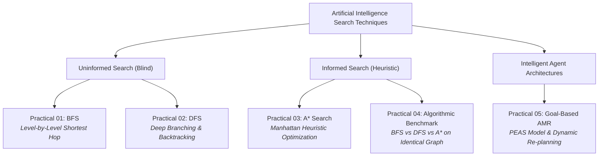

<div align="center">

# 🧠 Artificial Intelligence Fundamentals
### Laboratory Practicals & Real-World Heuristic Search Implementations

[](#)
[](#)
[](#)
[](#)
[](#)

<p align="center">
  <b>A comprehensive, production-grade repository implementing classical search algorithms, heuristic optimization, empirical benchmarking, and goal-based intelligent agents for university coursework.</b>
</p>

[Academic Profile](#-academic-profile) • [Search Taxonomy](#-search-taxonomy) • [Practicals Matrix](#-laboratory-practicals-matrix) • [Detailed Implementations](#-detailed-practical-breakdown) • [Empirical Benchmark](#-empirical-benchmarking--comparative-analysis) • [Getting Started](#-setup--execution-guide)

---

</div>

## 🎓 Academic Profile

<div align="center">

| Student / Institutional Attribute | Academic Record Details |
| :--- | :--- |
| **Candidate Name** | **Makarand Pankaj Bobhate** |
| **Roll Number** | **09** |
| **Institution** | **MIT ADT University, Pune** |
| **Department** | **School of Artificial Intelligence (SO AI)** |
| **Class & Division** | **B.Tech — Division 5** |
| **Course Subject** | **Artificial Intelligence Fundamentals (AI Fundamentals)** |
| **GitHub Account** | [@makarandbobhate](https://github.com/makarandbobhate) |
| **Repository Link** | [makarandbobhate/AIF-Practicals](https://github.com/makarandbobhate/AIF-Practicals) |

</div>

---

## 🗺️ Search Taxonomy

The laboratory assignments cover the foundational hierarchy of Artificial Intelligence search techniques, transitioning from uninformed exploration to heuristic optimization and dynamic deliberative agency:



---

## 📊 Algorithmic Characteristics & Theoretical Complexity

| Search Algorithm | Time Complexity | Space Complexity | Complete? | Optimal? | Primary Data Structure |
| :--- | :---: | :---: | :---: | :---: | :--- |
| **Breadth-First Search (BFS)** | $\mathcal{O}(b^d)$ | $\mathcal{O}(b^d)$ | Yes (if $b$ is finite) | Yes (for uniform cost) | FIFO Queue (`collections.deque`) |
| **Depth-First Search (DFS)** | $\mathcal{O}(b^m)$ | $\mathcal{O}(b \cdot m)$ | No (fails in infinite loops) | No | LIFO Call Stack / Explicit Stack |
| **A\* Search** | $\mathcal{O}(b^d)$ | $\mathcal{O}(b^d)$ | Yes | Yes (if $h(n)$ is admissible) | Min-Priority Heap (`heapq`) |

*Where $b$ = branching factor, $d$ = depth of the shallowest goal, $m$ = maximum depth of search tree.*

---

## 📂 Laboratory Practicals Matrix

| No. | Core Curriculum Objective | Real-World Reframing & Scenario | Key AI Concepts | Direct Link |
| :---: | :--- | :--- | :--- | :---: |
| **01** | Graph Traversal using BFS | **Smart City Emergency Evacuation**<br>Determines the safest, minimum-hop evacuation route to shelters during disasters. | Queue traversal, Level-order expansion, Shortest unweighted path | [practical_01_bfs_evacuation.py](./practical_01_bfs_evacuation.py) |
| **02** | Pathfinding using DFS | **Treasure Hunt Game**<br>Simulates deep chamber exploration with backtracking upon encountering dead ends. | Recursive stack, Backtracking state management, Visited sets | [practical_02_dfs_treasure_hunt.py](./practical_02_dfs_treasure_hunt.py) |
| **03** | Heuristic Search with A\* | **Hospital Medicine Delivery Robot**<br>Finds the shortest barrier-free route from a central pharmacy to an ICU ward. | Manhattan Distance heuristic, Priority queues, Cost function $f=g+h$ | [practical_03_astar_hospital_robot.py](./practical_03_astar_hospital_robot.py) |
| **04** | Search Comparison Study | **Smart City Road Network Benchmark**<br>Quantitatively compares BFS, DFS, and A\* on an identical 8-junction road map. | Path optimality, Search space expansion, Execution latency ($\mu s$) | [practical_04_compare_search_algorithms.py](./practical_04_compare_search_algorithms.py) |
| **05** | Intelligent Agent Design | **Autonomous Warehouse Mobile Robot (AMR)**<br>Delivers inventory pallets while evading unforeseen dynamic obstacles via live re-planning. | PEAS model, Sense-Plan-Act loop, Internal belief states, Dynamic re-planning | [practical_05_intelligent_warehouse_agent.py](./practical_05_intelligent_warehouse_agent.py) |

### 📑 Foundational Reference Scripts
- [`makarand_bfs.py`](./makarand_bfs.py) — 4-level filesystem directory tree traversal using BFS.
- [`makarand_dfs.py`](./makarand_dfs.py) — Undirected social friendship network traversal via recursive DFS.
- [`makarand_astar.py`](./makarand_astar.py) — 5-node weighted graph pathfinding with basic A\* search.

---

## 🔍 Detailed Practical Breakdown

### Practical 01: Smart City Emergency Evacuation (BFS)
- **Objective:** Model a municipal road network and route stranded citizens from a hazard zone (`Sector_4_Residential`) to the closest safe shelter.
- **Mechanism:** BFS explores outward in concentric wavefronts. The first shelter encountered is mathematically guaranteed to have the minimum number of road intersections.
- **Terminal Run:**
  ```bash
  python practical_01_bfs_evacuation.py
  ```
- **Discovered Route:**
  $$\text{Sector\_4\_Residential} \xrightarrow{} \text{Junction\_A} \xrightarrow{} \text{Central\_Avenue} \xrightarrow{} \text{Stadium\_Shelter} \quad (\text{Hops: } 3)$$

---

### Practical 02: Dungeon Treasure Hunt with Backtracking (DFS)
- **Objective:** Guide an adventurer through a subterranean dungeon maze containing deceptive branches and terminal dead-ends (`Skeleton_Pit`, `Cursed_Vault`, `Collapsed_Tunnel`).
- **Mechanism:** Deep-first recursion explores each passageway to terminal depth. When a dead-end is reached, the call stack unwinds (backtracks) to the preceding fork.
- **Terminal Run:**
  ```bash
  python practical_02_dfs_treasure_hunt.py
  ```
- **Discovered Route:**
  $$\text{Dungeon\_Entrance} \xrightarrow{} \text{Sunken\_Grotto} \xrightarrow{} \text{Crystal\_Cavern} \xrightarrow{} \text{Underground\_Lake} \xrightarrow{} \text{Treasure\_Chamber}$$

---

### Practical 03: Hospital Medicine Delivery Robot (A\* Search)
- **Objective:** Guide an autonomous ground vehicle (AGV) across an $8 \times 7$ hospital grid map from Pharmacy `(0, 0)` to Patient Ward `(6, 7)` while circumventing quarantine partitions.
- **Evaluation Function:**
  $$f(n) = g(n) + h(n)$$
  $$\text{where } g(n) = \text{accumulated steps}, \quad h(n) = |x - x_{\text{goal}}| + |y - y_{\text{goal}}| \text{ (Manhattan)}$$
- **Terminal Run:**
  ```bash
  python practical_03_astar_hospital_robot.py
  ```
- **Visual ASCII Floor Plan Output:**
  ```text
        0  1  2  3  4  5  6  7
     +-------------------------+
   0 |  P  *  *  *  ■  .  .  . |
   1 |  ■  ■  .  *  ■  .  ■  . |
   2 |  .  .  .  *  ■  .  ■  . |
   3 |  .  ■  .  *  *  *  *  * |
   4 |  .  ■  ■  ■  ■  ■  ■  * |
   5 |  .  .  .  .  .  .  ■  * |
   6 |  ■  ■  .  ■  ■  .  .  W |
     +-------------------------+
  ```

---

### Practical 04: Empirical Benchmarking — BFS vs DFS vs A\*
- **Objective:** Evaluate how differing graph search paradigms behave when subjected to the identical weighted 8-node smart city road network.
- **Terminal Run:**
  ```bash
  python practical_04_compare_search_algorithms.py
  ```
- **Empirical Findings:**

| Metric | BFS (Breadth-First) | DFS (Depth-First) | A\* (Heuristic Search) | Winner |
| :--- | :---: | :---: | :---: | :---: |
| **Path Discovered** | `Tech_Park` $\to$ `Cyber_Hub` $\to$ `City_Square` $\to$ `Airport` | `Tech_Park` $\to$ `Cyber_Hub` $\to$ `North_Ring` $\to$ `City_Square` $\to$ `Airport` | `Tech_Park` $\to$ `Metro_Central` $\to$ `South_Plaza` $\to$ `East_Gate` $\to$ `Airport` | **A\*** |
| **Total Route Cost** | 12.30 km | 15.70 km | **14.00 km (Optimal Weighted Path)** | **A\*** |
| **Nodes Explored** | 7 nodes | 8 nodes | **5 nodes** | **A\*** |
| **Hop Count** | **3 hops (Minimum)** | 4 hops | 4 hops | **BFS** |
| **Optimality Guarantee** | Unweighted Only | None | **Weighted Cost Optimal** | **A\*** |

---

### Practical 05: Autonomous Warehouse Robot (Intelligent Agent)
- **Objective:** Construct a goal-based autonomous mobile robot capable of fulfilling fulfillment-center transport requests while adapting to unexpected dynamic obstacles (fallen pallets/blockages).
- **PEAS Formal Framework:**
  - **P (Performance):** Minimize battery expenditure/steps, zero collisions, $100\%$ delivery rate.
  - **E (Environment):** $8 \times 8$ grid warehouse with stationary storage racks and dynamic obstructions.
  - **A (Actuators):** Steerable wheel motors (`UP`, `DOWN`, `LEFT`, `RIGHT`), robotic cargo lifter.
  - **S (Sensors):** Grid localization odometry (Cartesian coordinate tracking), forward optical obstacle detection.
- **Dynamic Adaptability:** When a dynamic blockage emerges at coordinate `(3, 3)`, the agent's sensory module invalidates the existing path, updates the internal world belief, and triggers an autonomous A\* re-plan to achieve the goal safely.
- **Terminal Run:**
  ```bash
  python practical_05_intelligent_warehouse_agent.py
  ```

---

## 🌳 Repository Directory Structure

```text
AIF-Practicals/
│
├── .gitignore                                  # Standardized Python, IDE, and OS exclusion rules
├── README.md                                   # Comprehensive academic & technical documentation
│
├── practical_01_bfs_evacuation.py              # Practical 1: BFS Smart City Evacuation System
├── practical_02_dfs_treasure_hunt.py           # Practical 2: DFS Dungeon Treasure Hunt with Backtracking
├── practical_03_astar_hospital_robot.py        # Practical 3: A* Search Hospital AGV Medicine Delivery
├── practical_04_compare_search_algorithms.py   # Practical 4: Benchmarking Suite (BFS vs DFS vs A*)
├── practical_05_intelligent_warehouse_agent.py  # Practical 5: Goal-Based Warehouse Agent (PEAS)
│
├── makarand_bfs.py                             # Reference Script: 4-Level Filesystem BFS Traversal
├── makarand_dfs.py                             # Reference Script: Recursive Social Network DFS
└── makarand_astar.py                           # Reference Script: Basic 5-Node Graph A* Pathfinding
```

---

## 🚀 Setup & Execution Guide

### System Requirements
- **Python Version:** 3.8, 3.9, 3.10, 3.11, or 3.12
- **External Dependencies:** **None**. All algorithms are written using Python's native standard library (`heapq`, `collections`, `time`, `typing`).

### 1. Clone the Repository
```bash
git clone https://github.com/makarandbobhate/AIF-Practicals.git
cd AIF-Practicals
```

### 2. (Optional) Initialize Isolated Environment
```bash
# Windows
python -m venv venv
.\venv\Scripts\activate

# Linux / macOS
python3 -m venv venv
source venv/bin/activate
```

### 3. Batch Verification
To execute and verify all practicals sequentially:
```bash
python practical_01_bfs_evacuation.py && python practical_02_dfs_treasure_hunt.py && python practical_03_astar_hospital_robot.py && python practical_04_compare_search_algorithms.py && python practical_05_intelligent_warehouse_agent.py
```

---

## 📜 Academic Integrity & License

This project is developed as part of the curriculum for **Artificial Intelligence Fundamentals** at the **School of Artificial Intelligence, MIT ADT University, Pune**. 

Distributed under the **MIT License**. See `LICENSE` for further permissions and limitations.

<div align="center">

**Makarand Pankaj Bobhate** • Roll No: **09** • Division: **5**  
*School of Artificial Intelligence, MIT ADT University, Pune*

</div>
